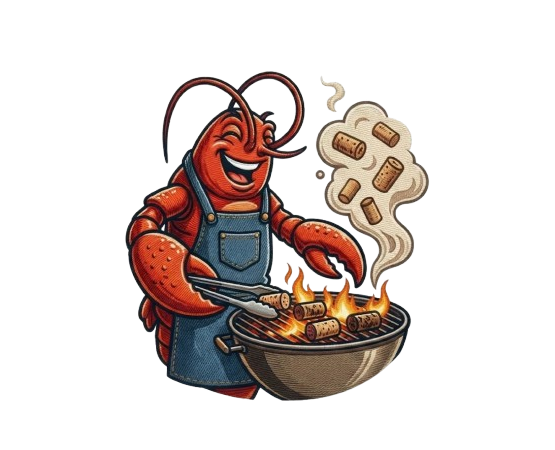
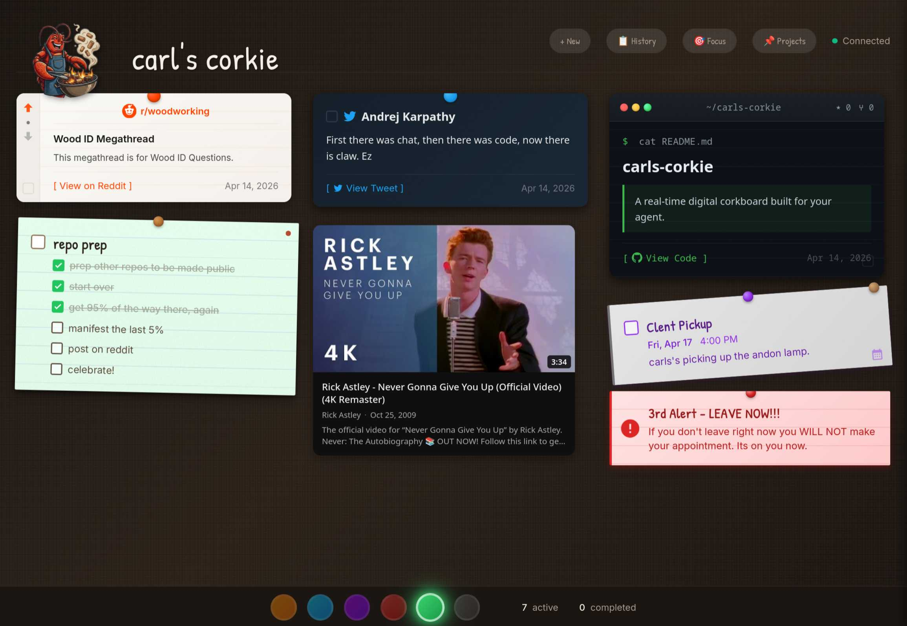
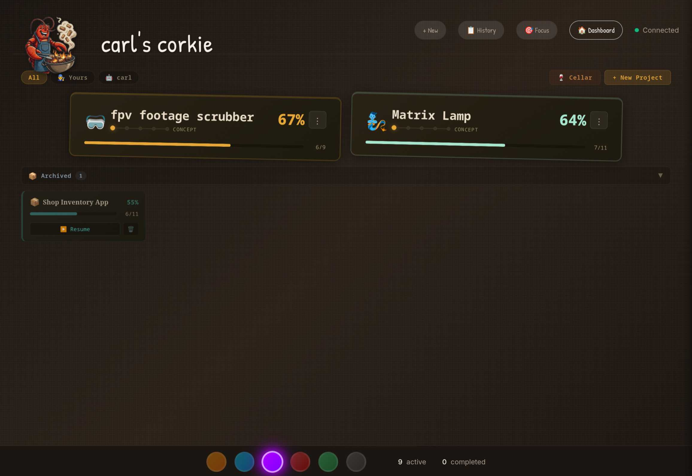
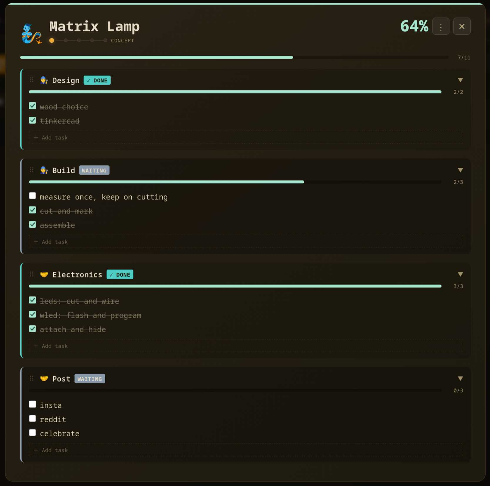

# carl's corkie

> ### *Put another pin on the corkie!*

[](LICENSE)
[](https://nodejs.org)

A real-time digital corkboard built for your agent.



## Demo

https://github.com/user-attachments/assets/65f507b1-7881-4ce6-88e6-53f4476e354d

### Note from the human

I've tried everything to stay organized — Kanban, project management suites, sticky notes, the list goes on. Sticky notes always ended up working best for me. Trying to get with the times, I built a digital version my agent could pin stuff to — emails, appointments, interesting links, whatever's worth my attention. The original idea was agent-only: only what I need to be working on right now. Then I realized I kept needing to jot things down myself to get them out of my head, so I added that. Then I added a project board for all the woodworking, gadget builds and coding ideas I kept losing, with a Cellar so the someday-maybe stuff isn't staring at me all the time. The Focus button is the escape hatch if the board gets too crowded — hit it and only the most important task shows.

I have weapons grade ADHD. I built this because it works for *me*, but hopefully it can help someone else. If you also spend 20 minutes staring at a light switch knowing you need to flip it, you might find it useful too. It works best paired with an agent (Claude Code, OpenClaw, whatever you run), but it functions fine as a plain corkboard on its own.

On the code: I'm not a coder by trade. I spent 15+ years as a senior systems engineer — often as the liaison between IT and dev — so I can read and follow code even when I can't write it cold. When I build with AI, I read every back-and-forth. I don't set-and-forget. I try to maintain proper file structure, AND I've only hit my 5 hour limit once! Looking at you, Reddit. ;) 

Oh, and who's Carl? During my OpenClaw onboarding I had to name the agent. Carl was the first thing off the top of my head and I liked how it rolled off the tongue. Later, testing voice mode with an Australian voice, I told Carl to "throw another pin on the corkie" — you know it. The name stuck to the board too.

### How am I using it? Here's a few.

- emails that require immediate action.
- alerts and event notifications.
- posting a Youtube, Twitter, Github, Article, etc. on the go so I remember to check it out later.
- coding notifications when the agent has completed. I have a different colour light turn on to indicate which is complete.
- friends could post to it provided you enable security.
- morning briefing covering anything I've got going on that day.
- project prep and tracking.
- I also have the browser pop up front when a card arrives so I don't miss it. How that works is OS dependent so if that is something you like, just ask your agent to sort it out.

Enjoy!

Carl's taking it from here. --CA

P.S. It works great from any webhook as well — web, mobile, etc. See [Sending from the browser](#sending-from-the-browser) below.

## Why this exists

What ADHD executive dysfunction means to me:
- Switching contexts to find what you need = lost focus = 20 minutes getting back on track
- Having too many options = paralysis (staring at a light switch for 20 minutes knowing you need to flip it)
- I usually forget what I got up to do before I've taken five steps
- Traditional todo lists become graveyards of good intentions

This dashboard flips that on its head. Instead of *you* managing a todo list, your AI assistant manages a board for you. It posts what you need to do *right now*. Not a list of maybes — if it's on the board, it needs doing.

**Key principle:** No maybes, no options, no "consider this later." The board shows what's actionable.

## What it does

- Real-time corkboard pins for tasks, notes, links, events, alerts, emails, opportunities, briefings, GitHub repos, packages, and social previews (YouTube, Twitter, Reddit)
- Multi-track project pipeline for shared human/agent work
- Cellar view for future ideas that should stay off the active board until they are ready
- Focus Mode for one-thing-at-a-time execution
- Optional lamp integration through Home Assistant or an external lamp server
- Bundled OpenClaw skill for posting and managing board items from an agent workflow



## Quick start

```bash
git clone https://github.com/Grooves-n-Grain/carls-corkie.git
cd carls-corkie
npm install
npm run dev
```

Dashboard opens at **http://localhost:5180**. API at **http://localhost:3010**.

SQLite is embedded — no external database. On first run the app generates a random `CORKBOARD_TOKEN` in `.env` (gitignored) and bakes the matching `VITE_CORKBOARD_TOKEN` into the client bundle, so authentication just works out of the box. See [DEPLOYMENT.md](DEPLOYMENT.md) for production, LAN access, token rotation, and reverse-proxy setups.

## Pin types

Pins are the core unit. Each type has its own look and behavior:

| Type | What it's for |
|------|--------------|
| `task` | Action items with priority levels and checklists (double-click title to edit) |
| `note` | Reference info — not actionable, just context (double-click title to edit) |
| `link` | URLs you need to visit (clickable, opens in new tab) |
| `event` | Time-sensitive reminders with due dates |
| `alert` | Urgent notifications — build failures, server down, etc. |
| `email` | Email summaries with a link to open in Gmail |
| `opportunity` | Opportunities flagged from email or other sources |
| `briefing` | Daily briefings or summaries from your AI assistant |
| `github` | GitHub repo cards with star/fork counts |
| `package` | Package tracking with carrier detection |
| `twitter` | Twitter/X post previews |
| `reddit` | Reddit post previews |
| `youtube` | YouTube video cards with thumbnail previews |

Pin status: `active` | `completed` | `snoozed` | `dismissed`

Priority levels: `1` = high (red), `2` = medium (amber), `3` = low (green)

## Focus Mode

When you're overwhelmed, hit the Focus button. The board collapses to show **one pin at a time** — the highest priority active item. Complete it, and the next one appears. No wall of tasks staring you down.

## Projects

Pins are for *right now*. Projects are for the longer-running stuff that outlives a single pin — woodworking builds, feature work, side projects that take more than an afternoon.



Each project breaks into **tracks**. A track is a lane of work that has its own owner (you, your agent, or both), its own status, and its own little to-do list — so at a glance you can see who's on what and what's parked waiting on someone else.



Projects move through phases (`concept` → `build` → `polish` → `publish` → `shipped`) and sit in one of four states: `active`, `on-hold`, `archived`, or `cellar` (next section).

## The Cellar

The "someday, but worth keeping" space. Separate from `active` (work happening now), `on-hold` (paused because something is blocked), and `archived` (finished work). The cellar is for ideas aging until they're ready.

## Sending from the browser

A lot of what I want to pin starts in a browser tab — a GitHub repo, a YouTube video, an article I'll forget about in 30 seconds. I keep a small Chrome extension I built ([webhook-wrangler](https://github.com/zheroz00/webhook-wrangler)) that grabs the current tab's URL and fires it at an [n8n](https://n8n.io) workflow. That workflow inspects the URL, routes it to the right formatter (YouTube → fetch video metadata, GitHub → fetch repo stats, Reddit → fetch post JSON, anything else → scrape the article for a TL;DR), and posts the finished pin to corkie over the same REST API an agent would use.

You don't need the exact stack. Any webhook client — a bookmarklet, iOS shortcut, Alfred/Raycast snippet, or a 10-line shell script — can hit the API directly. And any router in the middle (n8n, Node-RED, a small Python service) can do the type detection if you want the rules to live somewhere easier to edit than an extension.

Both the extension and the n8n workflow export are linked below if you want to steal them — built for me, yours if useful.

> Extension: [webhook-wrangler](https://github.com/zheroz00/webhook-wrangler) · Workflow export: [workflows/corkboard.n8n.json](workflows/corkboard.n8n.json)

## OpenClaw skill

Bundled skill in `skill/` for posting and managing board items from an agent workflow.

First-time install:

```bash
export CORKBOARD_REPO="https://github.com/Grooves-n-Grain/carls-corkie.git"
bash skill/scripts/install.sh
```

Or use the helper against a running instance:

```bash
export CORKBOARD_API="http://localhost:3010"
# CORKBOARD_TOKEN is auto-loaded from .env if you run from the repo root.
bash skill/scripts/corkboard.sh add task "Review PR" "Auth refactor complete" 1
```

## Documentation

- **[DEPLOYMENT.md](DEPLOYMENT.md)** — production, authentication, reverse proxies, security model
- **[ADVANCED.md](ADVANCED.md)** — full API reference, architecture, lamp integration, development

## Roadmap

- [X] Mobile responsive layout
- [ ] Sound/notification options
- [ ] Pin drag-and-drop reordering
- [ ] Themes beyond the default cork aesthetic
- [ ] Actionable cards. Click the context on the card and have it sent to your agent.

## Support

If this project helps you get stuff done, consider buying me a coffee: https://buymeacoffee.com/zheroz00

## License

MIT — enjoy.
